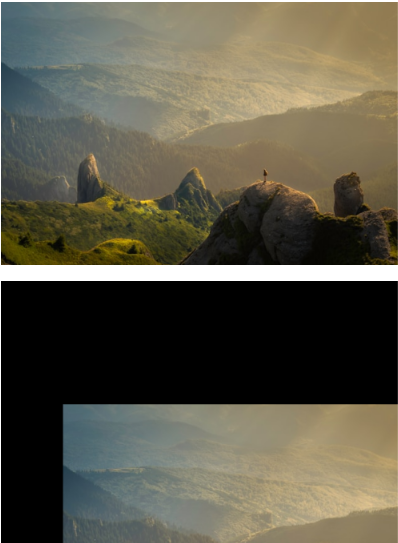
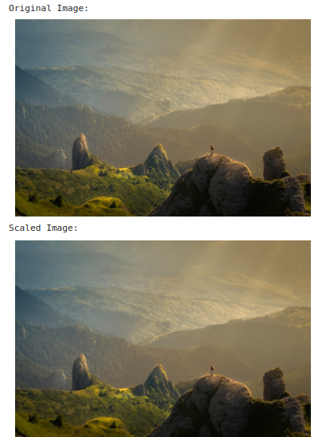
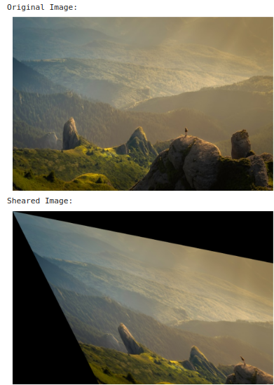
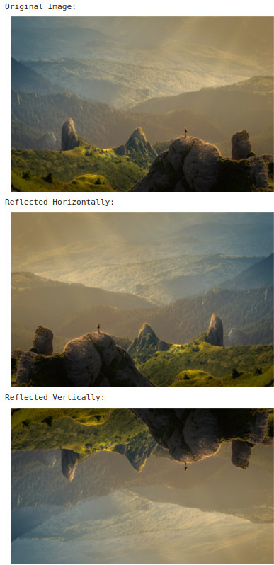
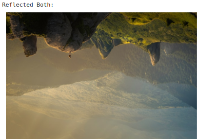
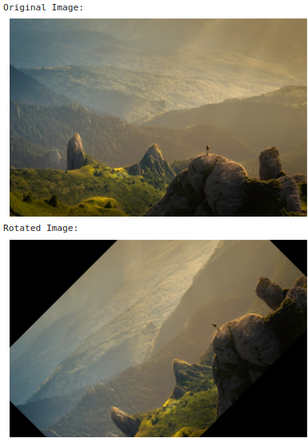
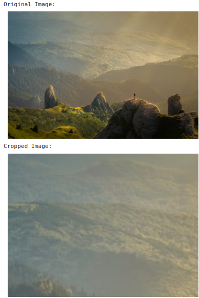

# IMAGE-TRANSFORMATIONS


## Aim
To perform image transformation such as Translation, Scaling, Shearing, Reflection, Rotation and Cropping using OpenCV and Python.

## Software Required:
Anaconda - Python 3.7

## Algorithm:
### Step1:
Import numpy module as np and pandas as pd.
### Step2:
Assign the values to variables in the program.
### Step3:
Get the values from the user appropriately.
### Step4:
Continue the program by implementing the codes of required topics.
### Step5:
Thus the program is executed in jupyter notebook.
## Program:
```
Developed By: Sam Israel D
Register Number: 212222230128
```

##### i)Image Translation
```python
import numpy as np
import cv2
import matplotlib.pyplot as plt


input_image = cv2.imread("nature.jpg")


input_image = cv2.cvtColor(input_image, cv2.COLOR_BGR2RGB)


plt.axis('off')


plt.imshow(input_image)
plt.show()


rows, cols, dim = input_image.shape


M = np.float32([[1, 0, 100],
                [0, 1, 200],
                [0, 0, 1]])  # Fixed the missing '0' and added correct dimensions


translated_image = cv2.warpPerspective(input_image, M, (cols, rows))


plt.axis('off')


plt.imshow(translated_image)
plt.show()
```

##### ii) Image Scaling
```python
import cv2
import numpy as np
from matplotlib import pyplot as plt


def show_image(image):
    plt.figure(figsize=(6, 6))
    plt.imshow(cv2.cvtColor(image, cv2.COLOR_BGR2RGB))
    plt.axis('off')
    plt.show()


image_url = 'nature.jpg'  
image = cv2.imread(image_url)


scale_x = 1.5  
scale_y = 1.5  


scaled_image = cv2.resize(image, None, fx=scale_x, fy=scale_y, interpolation=cv2.INTER_LINEAR)


print("Original Image:")
show_image(image)
print("Scaled Image:")
show_image(scaled_image)
```


##### iii)Image shearing
```python
import numpy as np
from matplotlib import pyplot as plt

# Function to display images in Colab
def show_image(image):
    plt.figure(figsize=(6, 6))
    plt.imshow(cv2.cvtColor(image, cv2.COLOR_BGR2RGB))
    plt.axis('off')
    plt.show()


image_url = 'nature.jpg'  
image = cv2.imread(image_url)


shear_factor_x = 0.5  
shear_factor_y = 0.2  


shear_matrix = np.float32([[1, shear_factor_x, 0], [shear_factor_y, 1, 0]])


sheared_image = cv2.warpAffine(image, shear_matrix, (image.shape[1], image.shape[0]))


print("Original Image:")
show_image(image)
print("Sheared Image:")
show_image(sheared_image)
```
##### iv)Image Reflection
```python
import cv2
import numpy as np
from matplotlib import pyplot as plt


def show_image(image):
    plt.figure(figsize=(6, 6))
    plt.imshow(cv2.cvtColor(image, cv2.COLOR_BGR2RGB))
    plt.axis('off')
    plt.show()


image_url = 'nature.jpg'  


reflected_image_horizontal = cv2.flip(image, 1)


reflected_image_vertical = cv2.flip(image, 0)


reflected_image_both = cv2.flip(image, -1)


print("Original Image:")
show_image(image)
print("Reflected Horizontally:")
show_image(reflected_image_horizontal)
print("Reflected Vertically:")
show_image(reflected_image_vertical)
print("Reflected Both:")
show_image(reflected_image_both)
```

##### v)Image Rotation
```python
import cv2
import numpy as np
from matplotlib import pyplot as plt

# Function to display images in Colab
def show_image(image):
    plt.figure(figsize=(6, 6))
    plt.imshow(cv2.cvtColor(image, cv2.COLOR_BGR2RGB))
    plt.axis('off')
    plt.show()


image_url = 'nature.jpg' 
image = cv2.imread(image_url)


angle = 45


height, width = image.shape[:2]


rotation_matrix = cv2.getRotationMatrix2D((width / 2, height / 2), angle, 1)


rotated_image = cv2.warpAffine(image, rotation_matrix, (width, height))

print("Original Image:")
show_image(image)
print("Rotated Image:")
show_image(rotated_image)
```

##### vi)Image Cropping
```python
import cv2
import numpy as np
from matplotlib import pyplot as plt


def show_image(image):
    plt.figure(figsize=(6, 6))
    plt.imshow(cv2.cvtColor(image, cv2.COLOR_BGR2RGB))
    plt.axis('off')
    plt.show()


image_url = 'nature.jpg' 
image = cv2.imread(image_url)


x = 100  # Starting x-coordinate
y = 50   # Starting y-coordinate
width = 200  # Width of the cropped region
height = 150  # Height of the cropped region


cropped_image = image[y:y+height, x:x+width]


print("Original Image:")
show_image(image)
print("Cropped Image:")
show_image(cropped_image)


```
## Output:
### i)Image Translation


### ii) Image Scaling



### iii)Image shearing




### iv)Image Reflection





### v)Image Rotation


### vi)Image Cropping




## Result: 

Thus the different image transformations such as Translation, Scaling, Shearing, Reflection, Rotation and Cropping are done using OpenCV and python programming.
